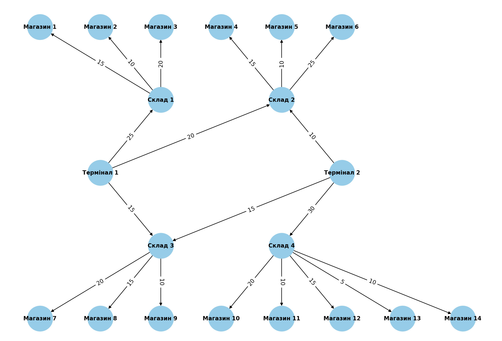
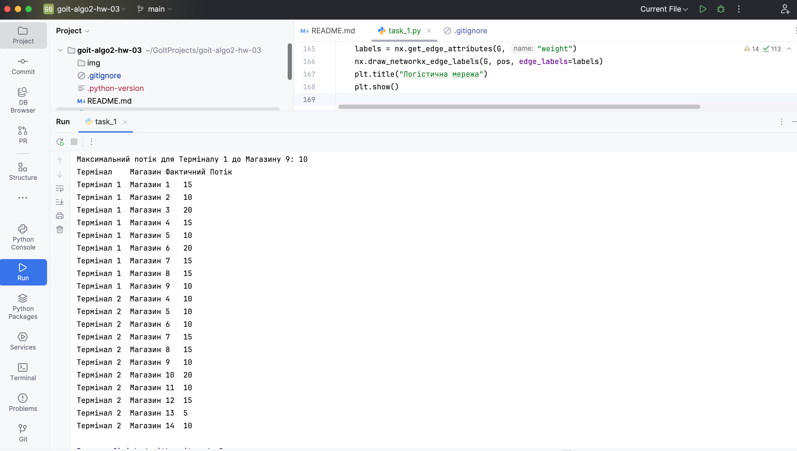
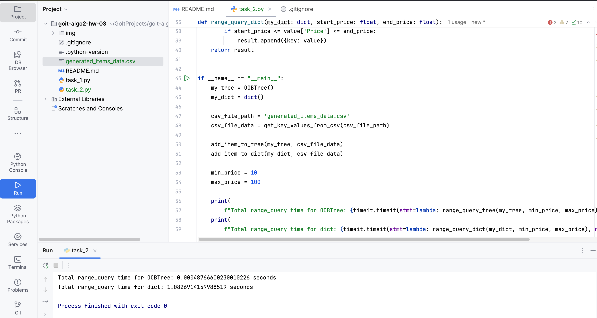

# goit-algo2-hw-03
Домашнє завдання до теми «Графи та дерева»

## Task 1
Цей проєкт реалізує алгоритм Едмондса-Карпа для обчислення максимального потоку в логістичній мережі, що складається з двох терміналів, чотирьох складів і чотирнадцяти магазинів. Мета — визначити розподіл потоків, виявити вузькі місця та запропонувати шляхи покращення ефективності.

### Опис
- **Термінали**: 2 (Термінал 1, Термінал 2).
- **Склади**: 4 (Склад 1, Склад 2, Склад 3, Склад 4).
- **Магазини**: 14 (Магазин 1–14).
- Пропускні здатності між вузлами задані в матриці `capacity_matrix`.

### Результати

#### Максимальний потік для прикладу
Максимальний потік від Терміналу 1 до Магазину 9: 10 одиниць.

#### Розподіл потоків
Нижче наведено таблицю фактичних потоків між терміналами та магазинами

| Термінал   | Магазин   | Фактичний Потік |
|------------|-----------|-----------------|
| Термінал 1 | Магазин 1 | 15              |
| Термінал 1 | Магазин 2 | 10              |
| Термінал 1 | Магазин 3 | 20              |
| Термінал 1 | Магазин 4 | 15              |
| Термінал 1 | Магазин 5 | 10              |
| Термінал 1 | Магазин 6 | 20              |
| Термінал 1 | Магазин 7 | 15              |
| Термінал 1 | Магазин 8 | 15              |
| Термінал 1 | Магазин 9 | 10              |
| Термінал 2 | Магазин 4 | 10              |
| Термінал 2 | Магазин 5 | 10              |
| Термінал 2 | Магазин 6 | 10              |
| Термінал 2 | Магазин 7 | 15              |
| Термінал 2 | Магазин 8 | 15              |
| Термінал 2 | Магазин 9 | 10              |
| Термінал 2 | Магазин 10| 20              |
| Термінал 2 | Магазин 11| 10              |
| Термінал 2 | Магазин 12| 15              |
| Термінал 2 | Магазин 13| 5               |
| Термінал 2 | Магазин 14| 10              |

#### Термінали з найбільшим потоком
Загальна сума пропускних здатностей: Термінал 1 — 60 одиниць, Термінал 2 — 55 одиниць.
**Термінал з найбільшим потоком**: Термінал 1.

#### Вузькі місця
Маршрути з мінімальною залишковою пропускною здатністю:
  - Склад 4 → Магазин 13: 5 одиниць.
  - Склад 1 → Склад 3: 10 одиниць.
  - Склад 2 → Магазин 7: 10 одиниць.
  - Склад 3 → Магазин 10: 10 одиниць.
  - Склад 4 → Магазин 14: 10 одиниць.

**Вплив**: Найменша пропускна здатність (Склад 4 → Магазин 13: 5 одиниць) обмежує загальний потік. Збільшення цієї здатності може підвищити ефективність.

#### Магазини з найменшим постачанням
Постачання кожного магазину (одиниці):
  - Магазин 1: 15
  - Магазин 2: 10
  - Магазин 3: 20
  - Магазин 4: 15
  - Магазин 5: 10
  - Магазин 6: 25
  - Магазин 7: 20
  - Магазин 8: 15
  - Магазин 9: 10
  - Магазин 10: 20
  - Магазин 11: 10
  - Магазин 12: 15
  - Магазин 13: 5
  - Магазин 14: 10

**Магазин з найменшим постачанням**: Магазин 13 (5 одиниць).
**Можливість покращення**: Постачання до Магазину 13 можна збільшити, підвищивши пропускну здатність маршруту Склад 4 → Магазин 13 (з 5 до 15 одиниць).

#### Покращення ефективності
**Вузькі місця для усунення**: Маршрут Склад 4 → Магазин 13 (5 одиниць) можна розширити до 15 одиниць, що підвищить загальну ефективність логістичної мережі.

## Task 2

### Результати

Total range_query time for OOBTree: 0.00048766600230010226 seconds

Total range_query time for Dict: 1.0826914159988519 seconds
